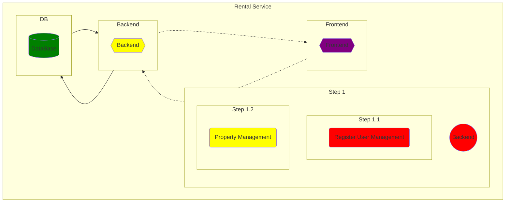
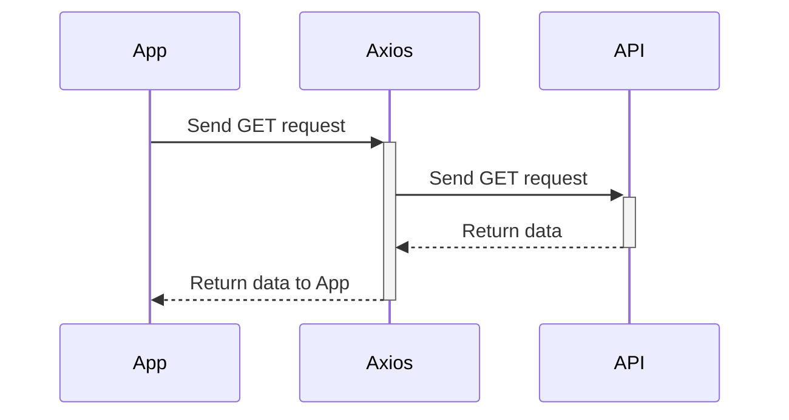

# RENTAL SERVICE APPLICATION

## Step1 Server Side

### User Management

- register
- validation with express validator
- Validate User email
- login
  #### Authentication & Authorization
  -isAdmin
  -isLoggedIn

## Step 2 CLIENT SIDE

- Basic setup √
- navbar √
- routing

## ADMIN DASHBOARD

- Basic app setup √
- set up pages √
- protect routing √
- make navbar √
- make a sidebar √
- use Redux to fetch products √
- render property card with api data
- create a property

\_----------TODO------
backend create property
frontend create property
