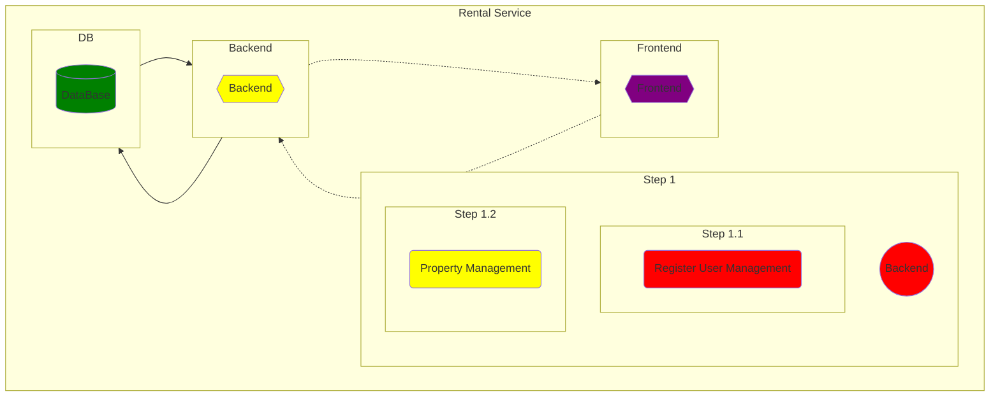
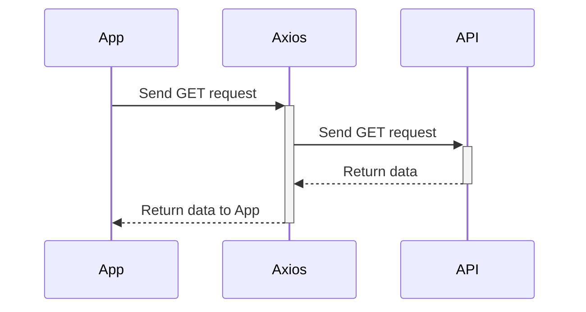

# RENTAL SERVICE APPLICATION

## Description

The Rental Service App is a web application designed to facilitate the rental of propperty(Home/Apartment) process. It provides a convenient platform for users to browse, search, and rent properties based on their specific needs. The app aims to streamline the rental experience, making it easier for both renters and property onners to connect and transact.

## Key Features

- User registration and authentication: Users can create accounts, log in, and manage their profiles.
- Property listing and search: The app allows users to search for available rental property based on different criteria such as category or location.
- Rental booking: Users can view item details, check availability, and contact the property owner.
- Rental management: Landlords can manage their rental property, update property, and delete property.
- Customer support: The app may offer customer support features, such as chat or messaging, to assist users with inquiries or issues.

## Technologies Used

- Front-end: HTML, CSS,Scss, JavaScript, React.js, Typescript
- Back-end: Node.js, Express.js, Nodemailer,
- Operations: Linux, AWS & Azure DevOps
- Database: MongoDB
- Authentication: JSON Web Tokens (JWT)

## Installation

- Clone the repository:
  git clone <https://github.com/Richpong212/FullStack-Rental-App.git>
- Install dependencies:

  - cd api
  - yarn install
  - cd customer
  - yarn install

- Configure environment variables
  - SERVERPORT = PORT
  - MONGO_URI = DATABASEURL
  - AUTH_EMAIL = xxxx@mail.com
  - AUTH_EMAIL_PASSWORD = XXXX
  - CLIENT_URL = http://localhost:3000
  - JWT_SECRET = xxxxx

## Usage

1. Clone the repository to your local machine.
   git clone https://github.com/your-username/rental-service-app.git

2. cd rental-service-app/customer
   yarn install

cd ../api
yarn install

1. Configure the backend database connection by creating a .env file in the backend directory and providing the required environment variables.

- SERVERPORT = PORT
- MONGO_URI = DATABASEURL
- AUTH_EMAIL = xxxx@mail.com
- AUTH_EMAIL_PASSWORD = XXXX
- CLIENT_URL = http://localhost:3000
- JWT_SECRET = xxxxx

4. Start the backend server.

   - cd api
   - yarn start

5. Start frontend server

   - cd ../customer
   - yarn start

6. configure .env for frontend
   REACT_APP_API = http://localhost:port/api

7. Access the Rental Service App in your web browser at http://localhost:3000

8. Explore the app's features, create user accounts, and start managing rentals.

## Contributing

Please note that this project is not open to external contributors. As such, we are not accepting any pull requests or contributions from the community at this time. We appreciate your interest and enthusiasm, but we have dedicated internal resources working on this project.

However, we value feedback and suggestions. If you have any ideas or feedback regarding the project, please feel free to reach out to us through the appropriate channels. We appreciate your understanding and support.

## License

The Rental Service App is licensed under the MIT License.

## Acknowledgements

I would like to acknowledge the following open-source projects and resources that were used in the development of this app:

- React
- Node.js
- Express.js
- MongoDB
- Material-UI
- React Router

---

## Pushing to github Devs

- git chekout -a
- git checkout branch name
- git add .
- git commit -m updated
- git push origin <branchname>

## checking which files changes before pushing to github

- git pull
- git status
- git add .
- git commit -m "updating subnets"
- git push -u origin main/master
